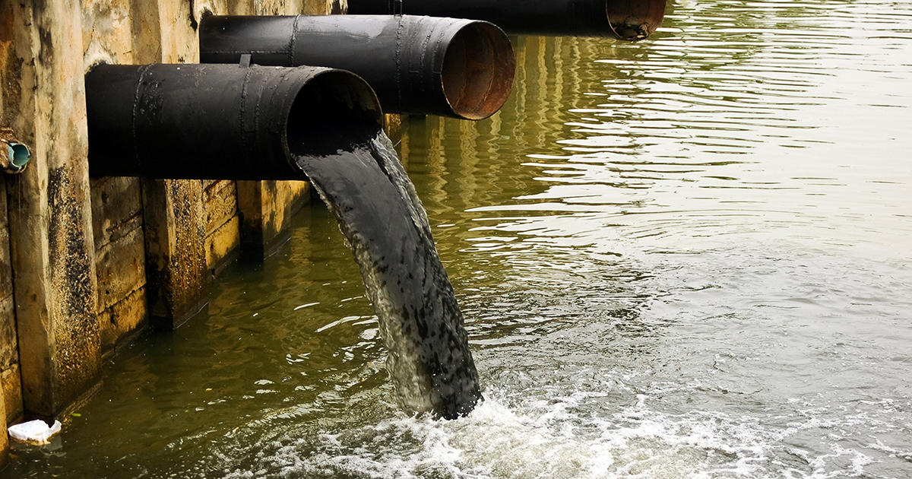
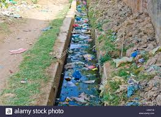
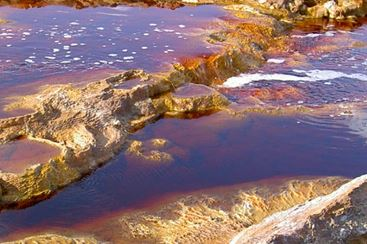
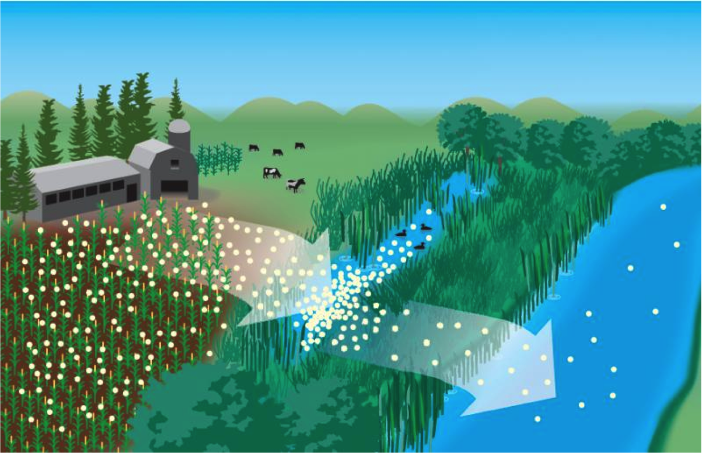
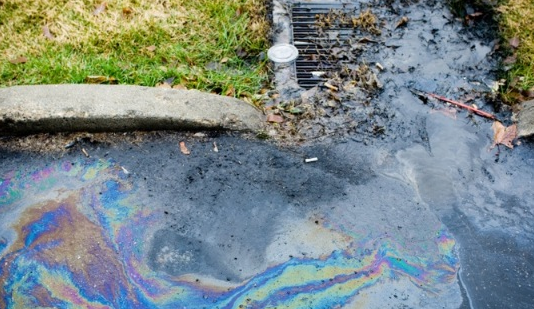

    

        College Of Engineering Trivandrum
    

    <h1 class="ass-heading">
        Sustainable Engineering Assignment  
        Water Pollution
    </h1>
    
       
    
Rahul T

    
S3 CSE Roll No:53

     
    
TVE19CS053

    

        Department of Computer Science   
        September 25, 2020
    

# Sources of Water Pollution

## 1. Industrial Waste

Industries produce a tremendous amount of waste, which contains toxic chemicals and pollutants. They contain harmful chemicals, including lead, mercury, sulfur, nitrates, asbestos, and many others.

Many industries, not having a proper waste management system, drain the waste in the freshwater, which goes into canals, rivers, and later into the sea.

The toxic chemicals may change the color of water, increase the number of minerals, called eutrophication, change the temperature of the water, and pose a severe hazard to water organisms.

## 2. Sewage and Wastewater

The sewage and wastewater that is produced in each household are treated chemically and released into the sea along with fresh water. The sewage water carries pathogens, a typical water pollutant, other harmful bacterias, and chemicals that can cause serious health problems and thereby diseases.

## 3. Mining Activities

Mining is the process of crushing the rock and extracting coal and other minerals from the underground. These elements, when extracted in the raw form, contain harmful chemicals and can increase the number of toxic elements when mixed up with water, which may result in health problems. Mining activities emit a large amount of metal waste and sulfides from the rocks, which is harmful to the water.

## 4. Chemical fertilizers and pesticides

Chemical fertilizers and pesticides are used by farmers to protect crops from insects and bacterias. They are useful for the plant’s growth. However, when these chemicals are mixed up with water, they produce harmful pollutants for plants and animals.

Also, when it rains, the chemicals mix up with rainwater and flow down into rivers and canals, which pose serious damages for aquatic animals.

## 5. Accidental Oil Leakage

Oil spill poses a huge threat to marine life when a large amount of oil spills into the sea and does not dissolve in water. It causes problems for local marine wildlife, including fish, birds, and sea otters.

A ship carrying a large quantity of oil may spill oil if met with an accident. Such an oil spill can cause varying damage to species in the ocean, depending on the amount of oil spill, the toxicity of pollutants, and the size of the ocean.

  

# Control measures of water pollution

## 1. Reduce the use of herbicides, pesticides, and fertilizers

Excessive use of herbicides, pesticides, and fertilizers leads to water pollution as the chemicals contained in the products often find way into the water systems through surface runoff or infiltration into the soil. Minimizing their usage or using organic methods for pest, weed, and disease control can appreciably reduce water pollution.

## 2. Practice tree planting.

Planting trees reduce the speed of surface water runoff and as such, lessens erosion and prevents toxic substances and chemicals from washing into water systems. If you live next to a water body, please take this initiative today and plant trees and vegetation covers such as flowers, grass, and shrubs.

## 3. Re-use automobile oil as much as possible and keep the vehicle well maintained

Re-using automobile oil reduces the amount of used oil that is discarded which may end up polluting water bodies. Also, it is essential to keep your vehicle well maintained so as to prevent the leakage of deadly fluids like oil and antifreeze.

## 4. Always opt for recyclable and reusable options

Reusable and recycled materials avoid the unnecessary use of water. By using these options, it, therefore, means you are conserving water. At the same time, you are minimizing the amount of waste water produced during production and processing. This should also include re-using dishware and linens such as towels and bed sheets.

## 5. Contact the local water protection and conservation authority whenever you notice any pollution activities.

Take the initiative of promptly contacting the relevant local water conservation office when you notice any kind of pollutant or chemical being discharged or injected into water bodies.

### References
- [https://www.conserve-energy-future.com/sources-and-causes-of-water-pollution.php](https://www.conserve-energy-future.com/sources-and-causes-of-water-pollution.php)
- [https://www.eartheclipse.com/pollution/amazing-ways-to-prevent-water-pollution.html](https://www.eartheclipse.com/pollution/amazing-ways-to-prevent-water-pollution.html)
- Google images

